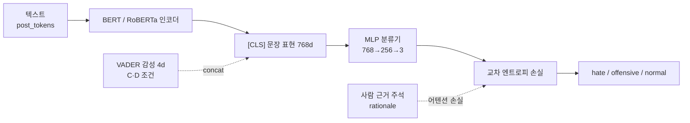

# 맥락까지 학습하는 혐오표현 탐지 — XAI 기반 검증 파이프라인

> **Context-aware Hate Speech Detection with a Rationale-guided Attention Loss, verified by a 4-axis XAI protocol.**
> HateXplain 데이터셋 위에서 *"선행연구 기반 가설 → 통제된 ablation → XAI 사후 검증"* 의 과학적 검증 프레임워크로, 혐오표현 탐지 모델의 **성능·재현성·설명 가능성**을 함께 정량화한 한성대학교 빅데이터프로그래밍 프로젝트입니다.


---

## 한눈에 보기

- **문제** — 비하어 매칭에 기대는 모델은 비하어 없는 *맥락 혐오*를 놓친다. 단어 자체가 신호가 아닌 게 아니라, **단어에 과의존**하는 게 문제다.
- **처방** — 사람이 표시한 근거(rationale) 토큰에 모델 어텐션을 정렬시키는 **근거 주석 기반 어텐션 손실**, 그리고 감성 맥락 보조 피처인 **VADER**(Cheng 2022 선행연구 기반 사전 가설).
- **핵심 결과** — 8조건 × 15시드(120회) 통제 실험에서 **`B_B`(BERT + 어텐션 손실)** 가 최고 성능. 기준 모델 `A_B` 대비 **Macro F1 +0.0060, Holm 보정 p = 0.0027 (유의, Cohen's d = 1.35)**.
- **정직한 한계** — VADER의 *독립* 효과는 약했다(ANOVA p = 0.52). 개선 폭은 통계적으로 유의하지만 수치상 작고, HateXplain 분포 안에서의 결론이다.

> 이 저장소는 SOTA 달성이 아니라, **혐오표현 탐지에서 성능·통계 신뢰성·설명 가능성을 한 프레임 안에서 비교하는 재현 가능한 실험 설계**를 보여주는 것을 목표로 합니다.

> 개선폭이 작은 이유, VADER가 약했던 이유, XAI의 한계 등 자주 나오는 질문은 **[FAQ.md](FAQ.md)** 에 정리했습니다.

---

## 연구 프레임워크

XAI를 모델 설계에 되먹이는 순환 구조가 아니라, **단방향 과학적 검증**입니다.


| 단계 | 내용 |
|---|---|
| **가설 (H1)** | 기준 BERT는 비하어 등 단어 단서에 과의존한다 |
| **처방** | ① 근거 주석 기반 어텐션 손실 ② VADER 감성 피처 |
| **검증 (H2·H3)** | 한 번에 한 처방만 바꾼 통제된 ablation으로 주효과·상호작용·강건성 분리 |
| **사후 해석** | XAI는 성능 개선의 *원인 증명*이 아니라, 판단 패턴이 가설과 일관적인지 보는 사후 근거 |

---

## 실험 설계 — 8조건 ablation

두 처방을 직교 축으로 두고, 두 사전학습 백본에 동일하게 적용합니다. 같은 시드·분할·하이퍼파라미터에서 **단일 변수만** 변경합니다.

| 조건 | 백본 | 어텐션 손실 | VADER | 의미 |
|:---:|:---:|:---:|:---:|---|
| `A_B` / `A_R` | BERT / RoBERTa | — | — | 기준 모델 |
| `B_B` / `B_R` | BERT / RoBERTa | ✓ | — | + 근거 정렬 어텐션 손실 |
| `C_B` / `C_R` | BERT / RoBERTa | — | ✓ | + VADER 감성 피처 |
| `D_B` / `D_R` | BERT / RoBERTa | ✓ | ✓ | 둘 다 |

- **데이터** — HateXplain 19,192건 (3분류: `hatespeech` 5,930 / `offensive` 5,473 / `normal` 7,789), 70/10/20 stratified split
- **반복** — 조건별 15개 random seed → **총 120회 학습**, 동일 시드 paired design
- **보조 베이스라인** — TF-IDF + Logistic Regression / Linear SVM (전통 ML 대조군), Freeze Study (인코더 동결 통제)
- **모델 입력 단일 소스** — 텍스트(`post_tokens`)만 입력. rationale·target은 학습 supervision/분석으로만 사용, 입력 아님

---

## 최종 결과 (15 seed × 8조건 = 120 runs)

| 조건 | 백본 | 어텐션 손실 | VADER | Macro F1 (mean ± std) | 비고 |
|:---:|:---:|:---:|:---:|:---:|---|
| **`B_B`** | BERT | ✓ | — | **0.6858 ± 0.0060** | **본 실험 최고 성능** |
| `D_B` | BERT | ✓ | ✓ | 0.6836 ± 0.0041 | 둘 다 (가장 안정적, 최저 분산) |
| `C_B` | BERT | — | ✓ | 0.6825 ± 0.0088 | VADER만 |
| `A_B` | BERT | — | — | 0.6798 ± 0.0076 | BERT 기준 |
| `B_R` | RoBERTa | ✓ | — | 0.6763 ± 0.0040 | RoBERTa 계열 최고 |
| `D_R` | RoBERTa | ✓ | ✓ | 0.6743 ± 0.0069 | 둘 다 |
| `C_R` | RoBERTa | — | ✓ | 0.6698 ± 0.0065 | VADER만 |
| `A_R` | RoBERTa | — | — | 0.6653 ± 0.0072 | RoBERTa 기준 |

### 통계 분석

핵심 비교는 **paired t-test + 평균 차이 + 95% CI + effect size**를 함께 보고, Holm 보정은 다중 비교 과대해석을 막는 보조 확인값으로 둡니다.

| 질문 | 결과 | 판정 |
|---|---|:---:|
| 어텐션 손실이 성능을 올리는가? (`A_B` → `B_B`) | +0.0060, Holm p = **0.0027**, d = 1.35 | 유의 |
| RoBERTa에서도 재현되는가? (`A_R` → `D_R`) | +0.0090, Holm p = **0.042** | 유의 |
| VADER의 *독립* 효과가 있는가? (`A_B` → `C_B`) | +0.0027, Holm p = 1.0 | 약함 |
| 백본 선택이 중요한가? (`D_B` vs `D_R`) | BERT 우위, Holm p = **0.009** | 유의 |

**3요인 ANOVA (Macro F1)** — 어느 요인이 성능 차이를 설명하는가:

| 요인 | η² | p-value | 해석 |
|---|:---:|:---:|---|
| 백본 (BERT/RoBERTa) | **0.390** | 3.0e-16 | 가장 큰 요인 |
| 어텐션 손실 | **0.096** | 6.2e-06 | 유의한 성능 요인 |
| 어텐션 손실 × VADER | 0.024 | 0.019 | 약한 상호작용 |
| VADER (단독) | 0.002 | 0.52 | 독립 효과 약함 |

> **읽는 법** — 성능을 끌어올린 실질 레버는 **근거 정렬 어텐션 손실**입니다. VADER는 단독으로는 유의하지 않았고, 어텐션 손실과의 상호작용에서만 약한 신호를 보였습니다. 이 결과는 통제된 8조건 실험 *안에서의* 상대 비교이며, 외부 SOTA 주장이 아닙니다.

---

## 제안 모델 — 기준 대비 변경점

기준 모델은 텍스트 인코더 출력만으로 분류합니다. 제안 모델은 **사람이 표시한 근거 주석을 학습 신호로 추가**하고, 선택적으로 VADER 감성 피처를 결합합니다.



- **손실** — `L_total = L_cls + α·L_attn (+ β·L_target)`
- **α 그리드** — {0.0, 0.1, 0.3, 0.5, 0.7, 1.0} 를 `B_B`에서 결정 후 `D_B`/`B_R`/`D_R`에 동일 적용
- **어텐션 손실** — 마지막 층 CLS 어텐션 분포를 사람 근거 토큰 위치에 BCE로 정렬. 추론 시에는 텍스트만 필요(rationale은 학습 때만)

---

## XAI — 4축 사후 검증

XAI는 최종 성능 주장의 근거가 아니라, **모델 판단 근거를 해석하는 사후 검증 계층**입니다. 대표 비교축은 `A_B` vs `D_B`.

| 축 | 무엇을 보는가 | 지표 |
|---|---|---|
| **1. Attribution** | 어떤 토큰을 지목하나 | SHAP · LIME · Overlap@5/@10 |
| **2. Faithfulness** | 그 토큰이 진짜 근거인가 | Comprehensiveness · Sufficiency · LOO |
| **3. Context Learning** | 한두 단어 집중 vs 여러 토큰 분산 | CI · MSS · Interaction Strength · Attention Rollout Entropy |
| **4. Plausibility** | 사람 근거와 닮았나 | Token Precision/Recall/F1@5 |

- 대표 체크포인트 비교에서 `D_B`가 사람 근거 정렬(Plausibility)·충실도(Faithfulness) 측면에서 개선되는 **경향**을 보였습니다.
- 계산 자원 제약으로 XAI는 전체 120 체크포인트가 아닌 대표 체크포인트 중심으로 수행했습니다. 따라서 XAI 결과를 `B_B` 성능 향상의 *직접 증거*로 과장하지 않습니다.
- 산출물은 report/dashboard가 바로 읽을 수 있는 **evidence bundle**(claims·faithfulness·context·plausibility·subgroup)로 정리됩니다.

---

## 엔지니어링 여정

단일 실험 스크립트에서, 재현 가능한 엔드투엔드 파이프라인으로 발전한 과정입니다.


| 라인 | 성격 | 핵심 |
|---|---|---|
| [`v1/`](v1/) | **개념 검증** | 초기 3-seed 실험으로 8조건 ablation 아이디어 검증. 과거 산출물 아카이브 |
| [`v2/`](v2/) | **최종 기준 구현** | 15-seed 반복 + `pipeline/`(오케스트레이션)·`runtime/`(학습·XAI) 2계층 |
| [`hatespeech/`](hatespeech/) | **모듈 재정렬본** | v2를 `src/`·`model/`·`config.yaml`(YAML 외부화)로 재구성한 리팩토링 후보 |

**v2에서 구축한 것** — `pipeline/` 계층 위에 다음을 자동화했습니다.

- 15-seed paired design, 동일 시드 통제, resume/gate 기반 배치 실행
- 자동 통계: paired t + **Holm 보정** + **2/3요인 ANOVA (η²·partial η²)** + bootstrap CI
- **XAI evidence bundle**: claims·faithfulness·context·plausibility·subgroup(source×target) 자동 생성
- 에폭별 **타이트 로깅** (`history.csv` 28컬럼: loss 분해·grad norm·per-class F1·confusion matrix·AMP scale)
- **AMP fp16**, cudnn 결정성, 토큰 근거 하이라이트 HTML, GitHub Actions preflight CI, 클라우드 GPU 운영 스크립트

---

## 저장소 구조

```text
.
├── README.md
├── v1/                          # 1차 파이프라인 (3-seed 개념검증) + 과거 산출물 아카이브
├── v2/                          # 최종 기준 구현 (15-seed E2E)  ← 기준 라인
│   ├── configs/                 # v2_15seed 실험 설정 (JSON)
│   ├── docs/                    # 모델·파이프라인·통계·XAI·실행·팀 문서 (25+편)
│   ├── pipeline/                # E2E 오케스트레이션·통계·XAI 번들·보고서 생성 (12 모듈)
│   ├── runtime/                 # 학습·추론·XAI·대시보드 실행 코드 (7 모듈)
│   ├── scripts/                 # 서버 실행·백업·gate check·체크포인트 정리
│   └── outputs/                 # 실험 산출물 (표준 CSV/JSON/보고서)
└── hatespeech/                  # v2 모듈 재정렬본 (src/·model/·config.yaml)
```

최종 기준 구현은 [`v2/`](v2/) 아래에 있습니다. 실험 산출물은 `v2/outputs/experiments/v2_15seed/` 규격을 따릅니다(대용량 체크포인트 `.pt`는 버전 관리 제외).

---

## 실험 재현

전체 실험은 CUDA GPU 환경을 권장합니다. 최종 실험은 클라우드 GPU에서 8조건 × 15시드 = 120회로 수행했습니다.

```bash
git clone https://github.com/WinterFlw/Big_data_Programming.git
cd Big_data_Programming

python -m venv .venv && source .venv/bin/activate
pip install -r v2/requirements.txt

cd v2
./run.sh e2e status      --run-id v2_15seed          # 파이프라인 상태 점검
./run.sh e2e plan        --run-id v2_15seed --force  # 120 run 계획 생성
./run.sh e2e benchmark   --run-id v2_15seed --execute --resume
./run.sh e2e aggregate   --run-id v2_15seed          # 요약·paired test·ANOVA
./run.sh e2e xai-primary --run-id v2_15seed          # 4축 XAI
./run.sh e2e xai-bundle  --run-id v2_15seed          # evidence bundle
./run.sh e2e report      --run-id v2_15seed          # 최종 보고서
./run.sh e2e dashboard   --run-id v2_15seed          # HTML 대시보드
```

표준 CSV·JSON·보고서·대시보드 산출물이 `v2/outputs/experiments/v2_15seed/` 아래에 생성됩니다.

### 주요 문서

| 문서 | 용도 |
|---|---|
| [`v2/docs/01_model_definition.md`](v2/docs/01_model_definition.md) | 모델 정의와 8조건 명세 |
| [`v2/docs/02_e2e_pipeline.md`](v2/docs/02_e2e_pipeline.md) | 엔드투엔드 파이프라인 개요 |
| [`v2/docs/03_validation_and_statistics.md`](v2/docs/03_validation_and_statistics.md) | 통계 검증 계획 (paired t·Holm·ANOVA) |
| [`v2/docs/04_xai_protocol.md`](v2/docs/04_xai_protocol.md) | XAI 4축 프로토콜과 해석 기준 |
| [`v2/docs/06_execution_runbook.md`](v2/docs/06_execution_runbook.md) | 서버·GPU 실행 가이드 |
| [`v2/docs/24_architecture.md`](v2/docs/24_architecture.md) | 연구 철학·모델 흐름 아키텍처 |
| [`FAQ.md`](FAQ.md) | 예상 질문과 답변 (성능·통계·XAI·포지셔닝) |

---

## 팀원 기여

| 프로필 | 역할 | 주요 기여 |
|---|---|---|
| <a href="https://github.com/WinterFlw"><br>정수현</a> | 팀장 / 프로젝트 총괄 / 파이프라인 통합 | 모델 파이프라인 구현, 실험 구조 개선, 중간 발표, 최종 통합 검수 |
| <a href="https://github.com/JunghunnKim"><br>김정훈</a> | 문제 정의 / 데이터 전처리 | 선행 논문 분석, 문제 정의, 데이터셋 준비, 라벨 매핑, 분할 검증 |
| <a href="https://github.com/jonghwa-8620"><br>박종화</a> | 데이터 분석 / 모델링 | 데이터 분석, EDA, 모델링 보조, 최종 발표 자료 구성 |
| <a href="https://github.com/silverzzo"><br>조은</a> | 결과 분석 / 문서 통합 | 데이터 분석, EDA, 실험 결과 해석, 문서 통합 |
| <a href="https://github.com/JongminCha"><br>차종민</a> | 선행 연구 / 파이프라인 시각화 | 선행 논문 분석, 파이프라인 개선·시각화, XAI 자료 정리 |

---

## 한계

- 성능 향상은 통계적으로 유의하지만 **수치상으로는 작습니다** (`A_B`→`B_B` +0.0060).
- **VADER 감성 점수는 강한 독립 개선 효과를 보이지 못했습니다** (ANOVA p = 0.52).
- XAI 분석은 계산 자원 제약으로 전체 120 체크포인트가 아닌 **대표 체크포인트 중심**으로 수행했습니다.
- HateXplain 분포 안에서의 결론이므로, 다른 데이터셋 일반화에는 추가 검증이 필요합니다.
- 대용량 체크포인트는 저장소에서 제외되어, 체크포인트 단위 재현은 학습 재실행이 필요합니다.

## 결론

근거 주석 기반 어텐션 학습은 본 통제 실험에서 BERT 기준 모델 대비 **작지만 통계적으로 유의하고 RoBERTa에서도 재현되는** 개선을 보였습니다. 이 프로젝트는 혐오표현 탐지에서 **성능·통계 신뢰성·설명 가능성을 함께 비교하는 재현 가능한 실험 프레임워크**로 활용할 수 있습니다.
