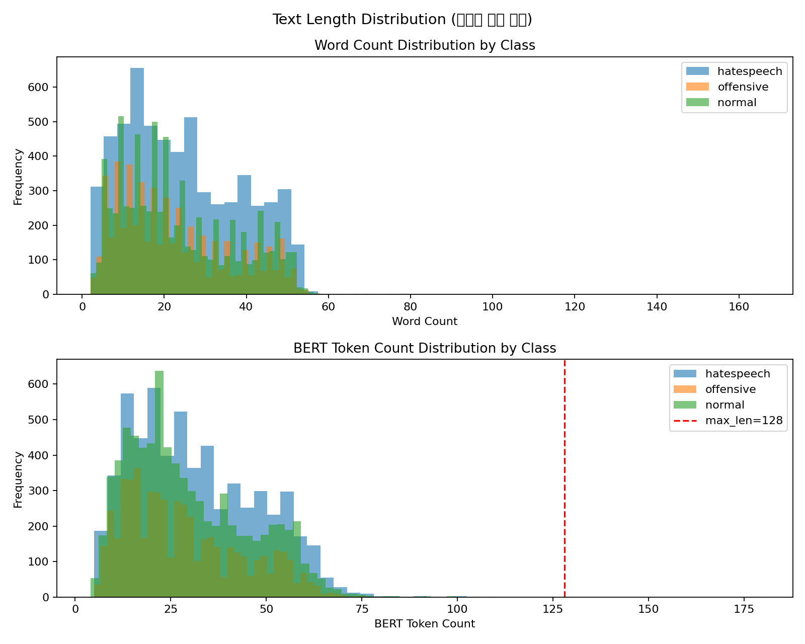
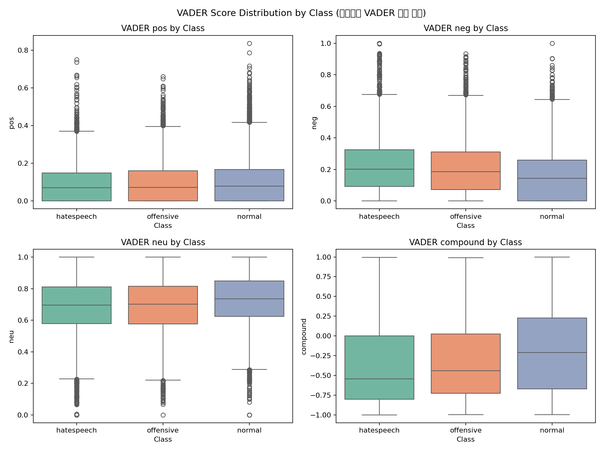
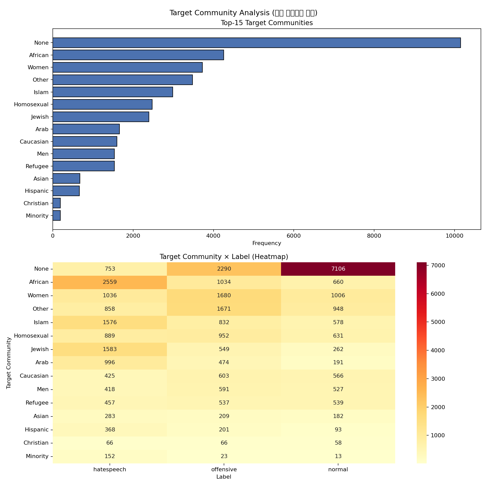

# EDA Report (탐색적 데이터 분석 보고서)

자동 생성된 EDA 보고서입니다.

---

## 1. 텍스트 길이 분포 (Text Length Distribution)

| Class | N | Word Mean | Word Median | Token Mean | Token Median | Exceed max_len (%) |
| --- | --- | --- | --- | --- | --- | --- |
| hatespeech | 5930 | 24.58 | 22.0 | 31.42 | 29.0 | 0.02% |
| offensive | 5473 | 22.38 | 19.0 | 28.41 | 25.0 | 0.0% |
| normal | 7789 | 23.37 | 20.0 | 29.67 | 26.0 | 0.0% |
| ALL | 19192 | 23.46 | 21.0 | 29.85 | 27.0 | 0.01% |

---

## 2. VADER 감성 점수 분포 (VADER Score Distribution by Class)

| Class | N | compound_mean | compound_std | neg_mean | neg_std | pos_mean | pos_std |
| --- | --- | --- | --- | --- | --- | --- | --- |
| hatespeech | 5930 | -0.358 | 0.5184 | 0.2216 | 0.1772 | 0.0907 | 0.1013 |
| offensive | 5473 | -0.283 | 0.5203 | 0.2088 | 0.1745 | 0.0962 | 0.108 |
| normal | 7789 | -0.1811 | 0.5452 | 0.1617 | 0.1532 | 0.1054 | 0.1188 |

> **핵심 발견**: hate compound=-0.358, offensive compound=-0.283, normal compound=-0.1811

---

## 3. 타겟 커뮤니티 분석 (Target Community Analysis)

고유 타겟 커뮤니티 수: **25**

| Rank | Target | Count |
| --- | --- | --- |
| 1 | None | 10149 |
| 2 | African | 4253 |
| 3 | Women | 3722 |
| 4 | Other | 3477 |
| 5 | Islam | 2986 |
| 6 | Homosexual | 2472 |
| 7 | Jewish | 2394 |
| 8 | Arab | 1661 |
| 9 | Caucasian | 1594 |
| 10 | Men | 1536 |
| 11 | Refugee | 1533 |
| 12 | Asian | 674 |
| 13 | Hispanic | 662 |
| 14 | Christian | 190 |
| 15 | Minority | 188 |

---

## 4. 클래스 혼동 분석 — 어휘 겹침 (Vocabulary Overlap)

상위 500개 단어 기준 Jaccard Similarity:

| Class A | Class B | Jaccard |
| --- | --- | --- |
| hatespeech | offensive | 0.7094 |
| hatespeech | normal | 0.6502 |
| offensive | normal | 0.773 |

---

*이 보고서는 `experiment_eda.py`에 의해 자동 생성되었습니다.*