# 24. v2 아키텍처 — Mermaid 다이어그램

> HateSpeachStudy v2_15seed 파이프라인의 전체 구조를 Mermaid로 정리한다.
> GitHub은 ```mermaid 코드블록을 자동 렌더링하므로, 이 문서를 GitHub에서 열면 그림으로 보인다.
> 마지막 업데이트: 2026-05-19

---

## 1. End-to-End 파이프라인 Stage 흐름

`run.sh e2e <stage>` → `pipeline/cli.py` → `pipeline/runner.py`가 각 stage를 호출한다.

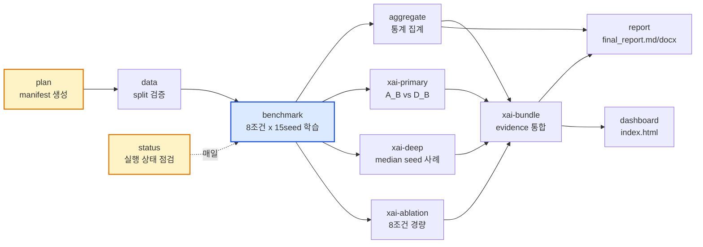

---

## 2. 모듈 아키텍처 — 4개 레이어

`pipeline/`은 얇은 orchestration, `runtime/`은 무거운 모델 코드. adapter가 둘을 잇는다.

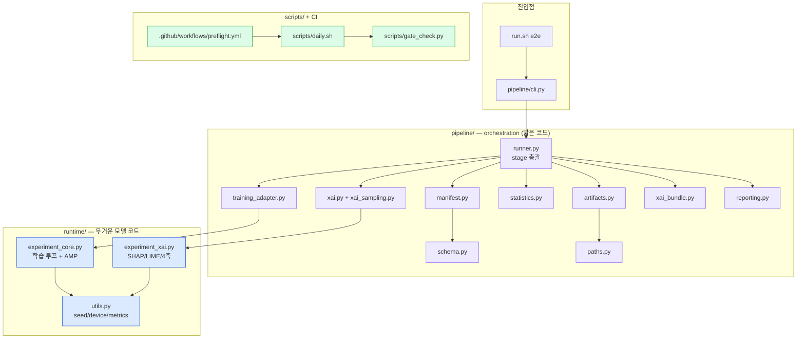

---

## 3. 8조건 Ablation 매트릭스 + 학습 흐름

`benchmark` stage가 2×2×2 조건 × 15 seed = 120 unit을 학습한다.

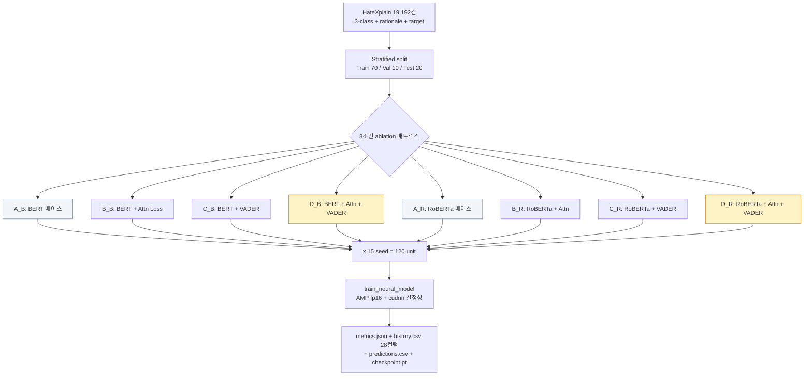

손실: `L_total = L_cls + α·L_attn (+ β·L_target)` — α는 B_B에서 그리드 결정 후 D_B/B_R/D_R 동일 적용.

---

## 4. XAI 4축 12지표 구조

`xai-primary/deep/ablation`이 자동 XAI 4축을 계산한다. 인간 라벨 의존을 최소화한 것이 본 연구 결정 카드.

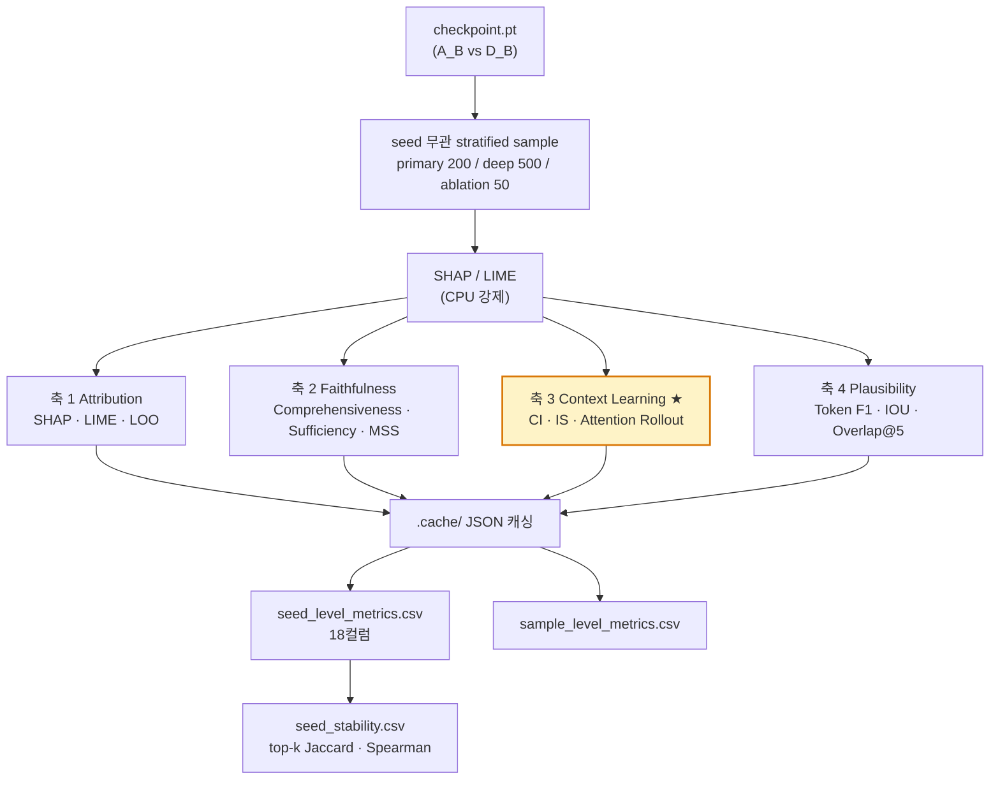

판정: H3 = 축 3 (CI ↓, IS ↑, MSS ↑)이 통계 유의 + RoBERTa 일관 → 맥락 학습 입증.

---

## 5. 5인 역할 + 산출물 + Git 흐름

서버 실행은 2번 단독, 나머지는 git pull로 결과를 받는다.

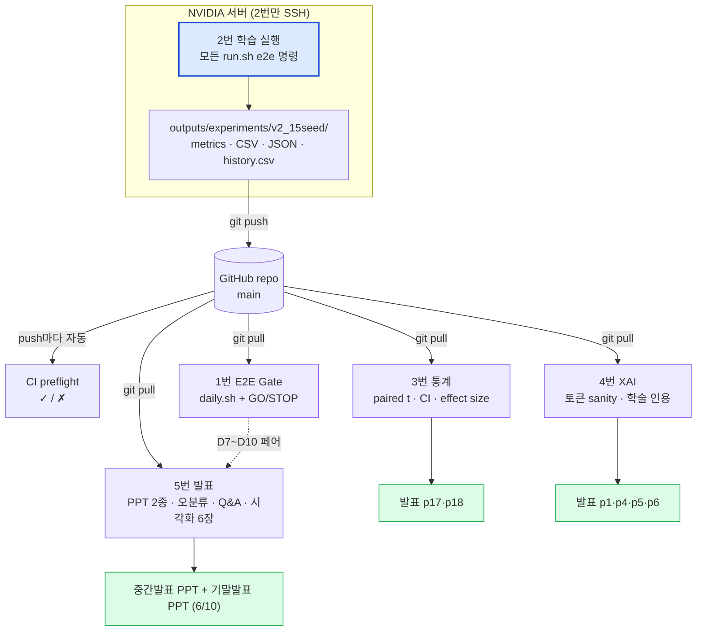

---

## 6. 데이터 흐름 — 모델 입력 단일 소스 원칙

모델은 텍스트(post_tokens)만 입력으로 받는다. rationale·target은 학습 supervision으로만 사용.

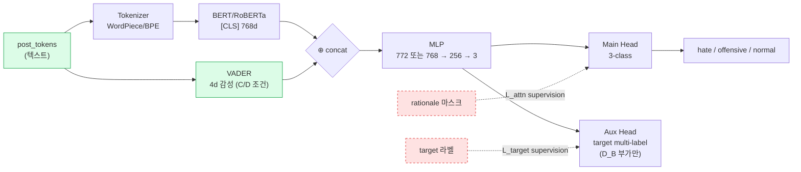

추론 시: 텍스트만 주어져도 동작 (Aux Head 무시, rationale/target 불필요).

---

## 7. CI 자동화 흐름

push마다 GitHub Actions가 preflight를 자동 실행한다.

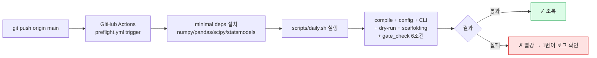

---

## 8. Stage별 입출력 명세 (INPUT → 처리 → OUTPUT)

각 stage가 정확히 무엇을 받아서 무엇을 내놓는지.

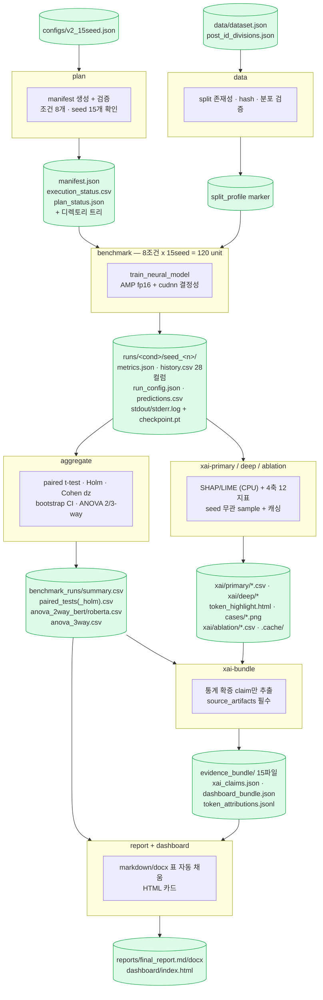

### 입출력 요약표

| Stage | INPUT | 처리 | OUTPUT |
|---|---|---|---|
| **plan** | `configs/v2_15seed.json` | manifest 생성·검증, 디렉토리 생성 | `manifest.json`, `execution_status.csv`, `plan_status.json` |
| **data** | `data/dataset.json` + `post_id_divisions.json` | split 존재·hash·분포 검증 | split_profile marker |
| **benchmark** | manifest + data split | 120 unit 학습 (AMP, cudnn) | unit별 `metrics.json` + `history.csv`(28컬럼) + `run_config.json` + `predictions.csv` + `checkpoint.pt` |
| **aggregate** | `runs/*/metrics.json` 120개 | paired t / Holm / Cohen dz / bootstrap CI / ANOVA | `benchmark_summary.csv` + `paired_tests(_holm).csv` + `anova_*.csv` 3종 |
| **xai-primary** | `checkpoints/*.pt` (A_B, D_B × 15seed) | SHAP/LIME + 4축 12지표 | `seed_level_metrics.csv`(18컬럼) + `sample_level_metrics.csv` + `paired_xai_tests.csv` + `seed_stability.csv` |
| **xai-deep** | `checkpoints/*.pt` (median seed) | 대표 case 분석 + 토큰 하이라이트 | `case_summary.csv` + `token_highlight.html` + `cases/*.png` |
| **xai-ablation** | `checkpoints/*.pt` (8조건 median) | 8조건 4축 경량 비교 | `xai_ablation_metrics.csv` (11컬럼) |
| **xai-bundle** | 위 xai 산출물 + benchmark CSV | claim 추출 (통계 확증만) | `evidence_bundle/` 15파일 |
| **report** | benchmark CSV + evidence_bundle | 표·claim 자동 삽입 | `final_report.md/docx` |
| **dashboard** | benchmark + xai summary | HTML 카드 렌더 | `dashboard/index.html` |

---

## 9. 학습이 하는 일 — benchmark stage 내부 상세

`train_neural_model`이 한 (condition, seed) unit에 대해 수행하는 흐름.

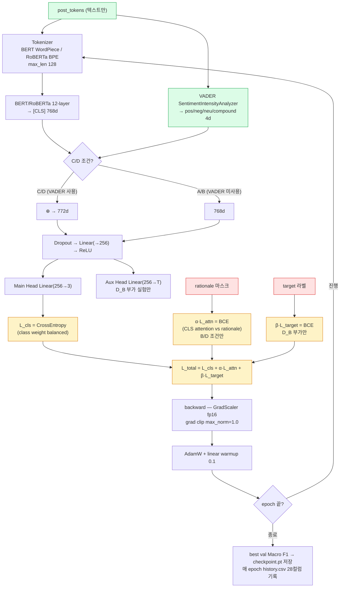

**핵심 원칙**: 모델 입력은 **텍스트(post_tokens)만**. rationale·target은 손실 함수의 supervision 신호로만 쓰이고 모델 입력에 안 들어감. VADER 4d는 텍스트에서 자동 계산되는 파생 피처라 "텍스트만 입력" 원칙 위배 아님.

---

## 9.1 BERT + VADER 조건 (C_B / D_B) 전체 상세 — STEP 0~4

C/D 조건은 `HybridTextDataset` + `TransformerConditionClassifier(use_vader=True)`를 쓴다. 텐서 shape 단위로 추적.

> 변수: `B`=batch(64) · `L`=seq(max 128) · `768`=BERT hidden · `4`=VADER · `256`=MLP hidden · `3`=labels · `T`=num_targets(~24, D_B 부가만)

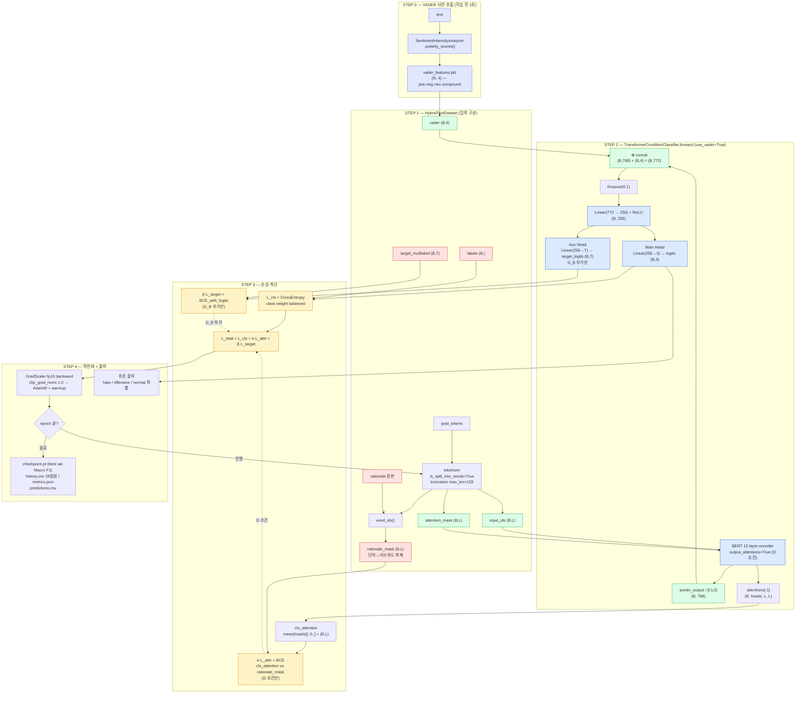

**C_B vs D_B 차이 (위 다이어그램에서)**

| 항목 | C_B (BERT+VADER) | D_B (BERT+VADER+Attn) |
|---|---|---|
| VADER concat | ✓ (B,772) | ✓ (B,772) |
| `output_attentions` | False | True |
| `α·L_attn` 점선 | 없음 | CLS attention ↔ rationale BCE |
| `β·L_target` 점선 | 없음 | D_B 부가 실험만 (듀얼 헤드) |
| `L_total` | `L_cls` | `L_cls + α·L_attn (+ β·L_target)` |

색 범례: 보라=VADER 사전추출 / 초록=모델 입력 / 빨강=supervision(입력 아님) / 파랑=모델 레이어 / 노랑=손실.

---

## 10. 입출력 검증 게이트 — 어디서 무엇을 막나

각 stage가 잘못된 입력을 어떻게 걸러내고 출력을 어떻게 보장하는지.

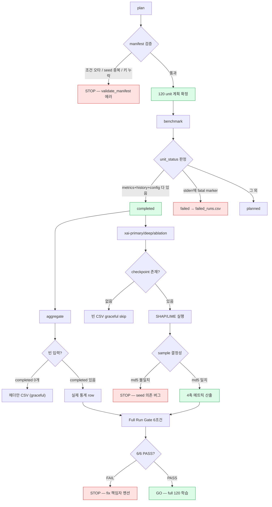

검증 규칙 요약:

| Stage | 입력 검증 | 출력 보장 |
|---|---|---|
| plan | `validate_manifest` — 조건 오타·seed 중복·키 누락 시 STOP | 120 unit `execution_status.csv` |
| benchmark | unit별 `metrics+history+config` 3개 다 있어야 completed | `failed_runs.csv` / `completed_runs.csv` 자동 분리 |
| aggregate | completed 0개여도 헤더만 CSV (graceful) | schema 컬럼 고정 — downstream 안 깨짐 |
| xai-* | checkpoint 없으면 빈 CSV skip | sample md5 일치 검사 (seed 무관성) |
| xai-bundle | 통계 미확증 결과는 strong claim 금지 | 모든 claim에 `source_artifacts` 필수 |
| Full Run Gate | 6조건 자동 점검 (`gate_check.py`) | 6/6 PASS만 full 학습 GO |

---

## 부록 — 디렉토리 구조

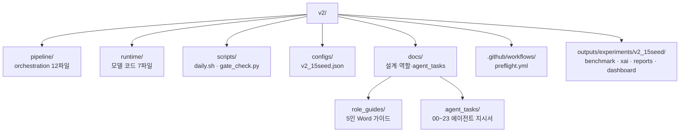

---

문서 끝.
