# 24. v2 아키텍처 — Mermaid 다이어그램

> HateSpeachStudy v2_15seed 파이프라인 구조. 모든 다이어그램은 **좌→우 직선 흐름**으로 큰 줄기가 한눈에 보이도록 그렸다.
> GitHub은 ```mermaid 코드블록을 자동 렌더링한다.
> 마지막 업데이트: 2026-05-19

---

## 1. 메인 파이프라인 (큰 줄기 한 줄)

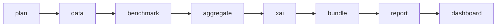

곁가지는 따로:

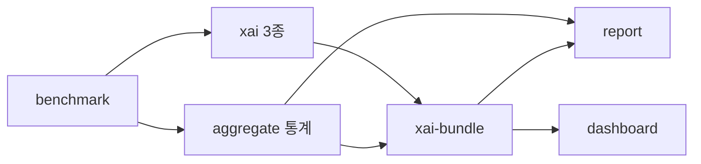

---

## 2. 모듈 레이어 (CLI → pipeline → runtime)

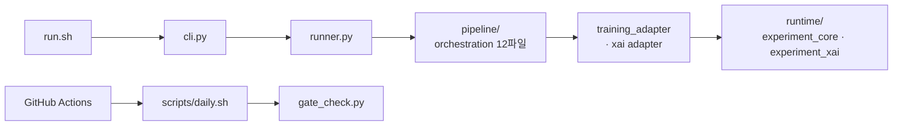

---

## 3. 학습 흐름 (데이터 → 8조건 → 산출물)

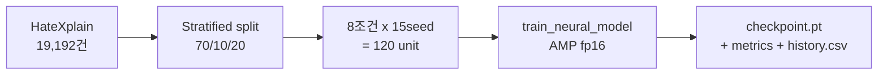

8조건 매트릭스:

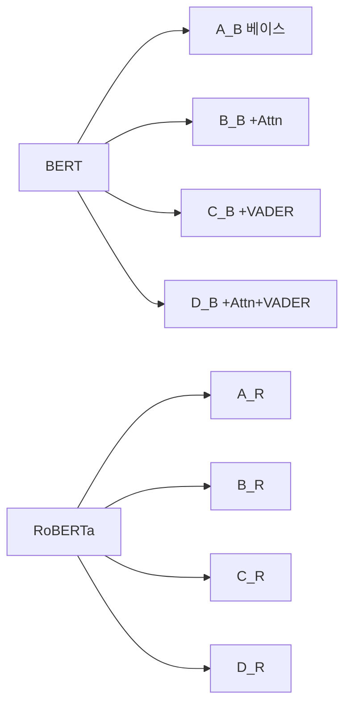

---

## 4. BERT + VADER 모델 내부 (forward 한 줄)

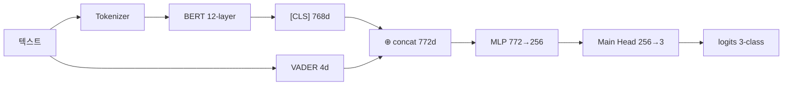

A/B 조건은 VADER 없이 768d 직행. C/D 조건만 `⊕ concat`으로 772d.

---

## 5. 손실 계산 (출력 → 3개 손실 → 합산)

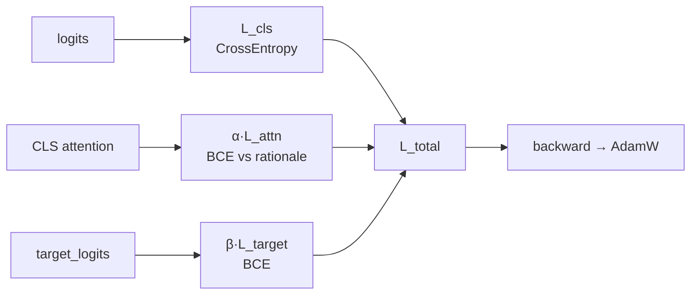

`L_total = L_cls + α·L_attn + β·L_target` — L_attn은 B/D 조건, L_target은 D_B 부가만.

---

## 6. XAI 4축 흐름 (checkpoint → 메트릭)

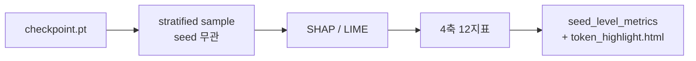

4축:

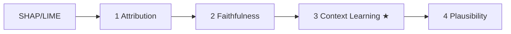

(축은 병렬 계산이지만 읽기 순서대로 나열 — 3축 Context Learning이 본 연구 결정 카드.)

---

## 7. 5인 역할 + Git 흐름

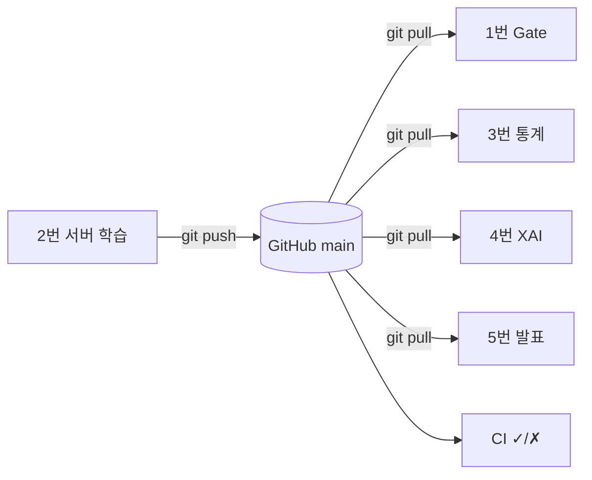

---

## 8. CI 자동화 흐름

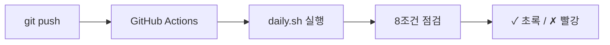

---

## 9. Stage별 입출력 (INPUT → stage → OUTPUT)

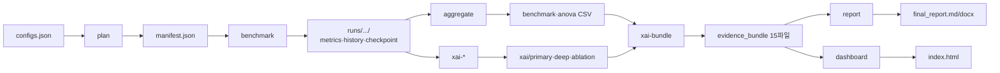

| Stage | INPUT | OUTPUT |
|---|---|---|
| plan | `configs/v2_15seed.json` | `manifest.json`, `execution_status.csv` |
| benchmark | manifest + data split | `metrics.json` + `history.csv`(28컬럼) + `checkpoint.pt` |
| aggregate | `runs/*/metrics.json` | `benchmark_summary.csv` + `paired_tests.csv` + `anova_*.csv` |
| xai-primary | `checkpoints/*.pt` | `seed_level_metrics.csv`(18컬럼) + `seed_stability.csv` |
| xai-deep | `checkpoints/*.pt` | `case_summary.csv` + `token_highlight.html` + `cases/*.png` |
| xai-ablation | `checkpoints/*.pt` | `xai_ablation_metrics.csv` |
| xai-bundle | xai 산출물 + benchmark CSV | `evidence_bundle/` 15파일 |
| report | benchmark CSV + bundle | `final_report.md/docx` |
| dashboard | benchmark + xai | `dashboard/index.html` |

---

## 10. BERT + VADER (C_B / D_B) STEP 0~4 상세

학습 전체를 단계별 좌→우로. 텐서 shape: `B`=batch · `L`=seq(128) · `768`=BERT · `4`=VADER · `256`=MLP · `3`=labels.

**STEP 0~1 — VADER 추출 + 입력 구성**

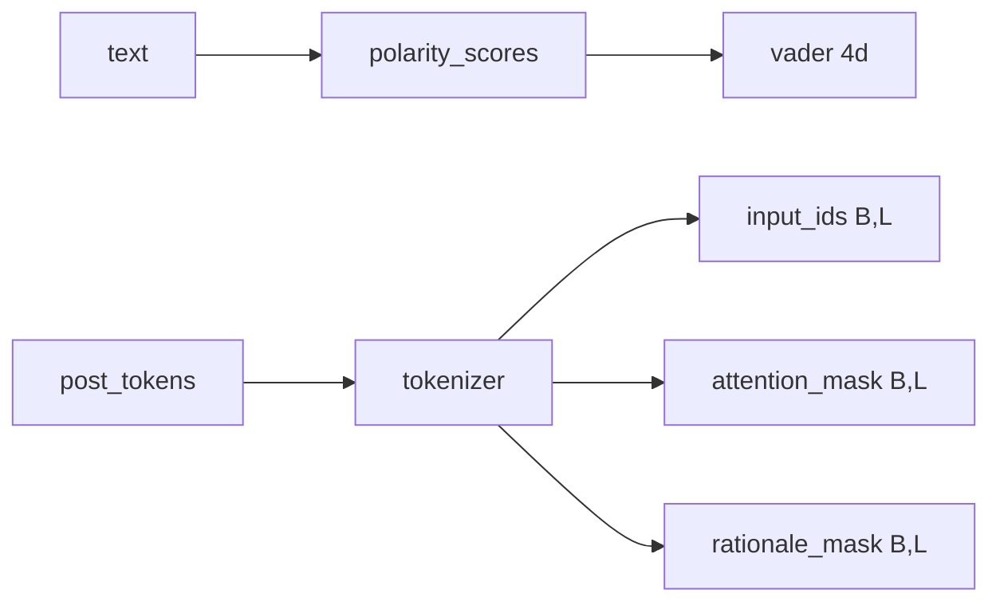

**STEP 2 — forward**

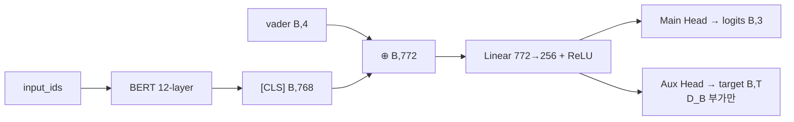

**STEP 3~4 — 손실 + 출력**

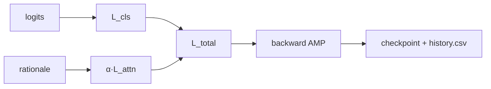

C_B는 `α·L_attn` 빼고 `L_total = L_cls`. D_B는 포함.

---

## 11. 입출력 검증 게이트 (어디서 막나)

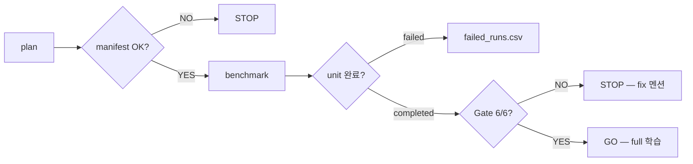

| Stage | 검증 |
|---|---|
| plan | 조건 오타·seed 중복·키 누락 → STOP |
| benchmark | metrics+history+config 3개 다 있어야 completed |
| aggregate / xai | 빈 입력이면 헤더만 CSV (graceful) |
| Full Run Gate | 6조건 자동 (`gate_check.py`) — 6/6만 GO |

---

## 12. 디렉토리 구조

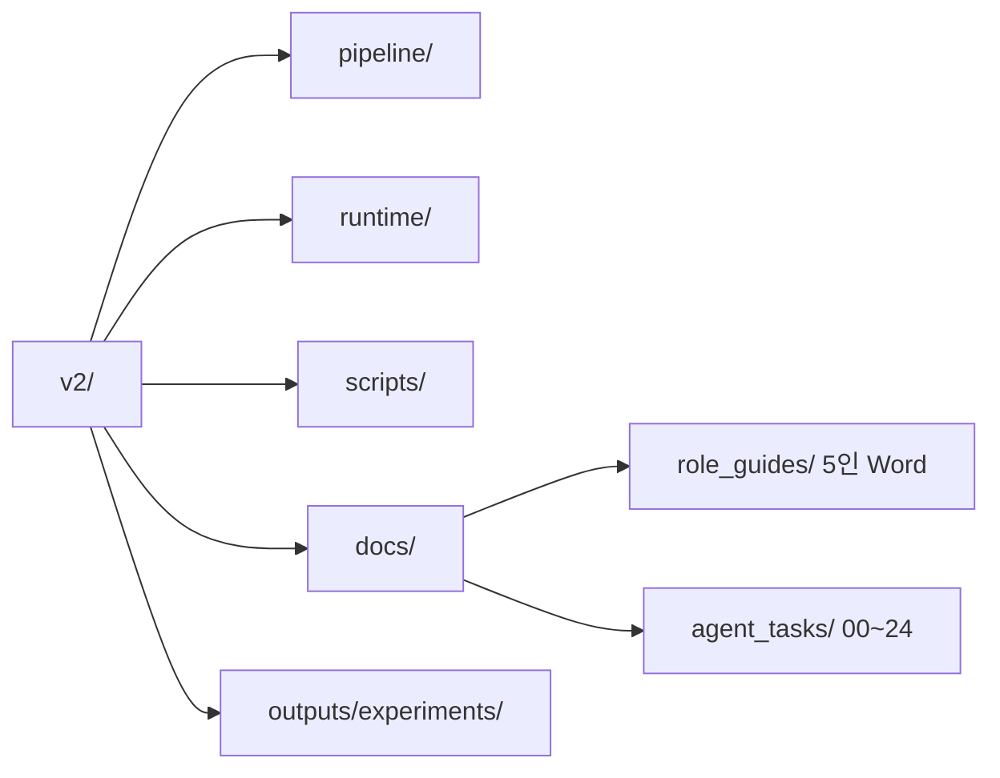

---

문서 끝.
