# 24. 연구 파이프라인 — 모델의 흐름과 철학

> 이 문서는 파일·디렉토리·CI 같은 엔지니어링이 아니라, **모델이 무엇을 왜 학습하는지**, 연구가 어떤 질문에서 출발해 어떻게 답하는지를 담는다.
> GitHub은 ```mermaid 코드블록을 자동 렌더링한다. 마지막 업데이트: 2026-05-19

---

## 0. 한 줄 — 무엇을 묻고 무엇으로 답하나

> 비하어에 기대는 모델은 맥락 혐오를 놓친다.
> **단어 단서를 유지하면서 맥락 단서까지 함께 학습한 모델**이 분류 성능과 판단 투명성 모두에서 나아짐을, 통제된 ablation과 자동 XAI로 입증한다.

---

## 1. 연구 서사 — 문제에서 결론까지

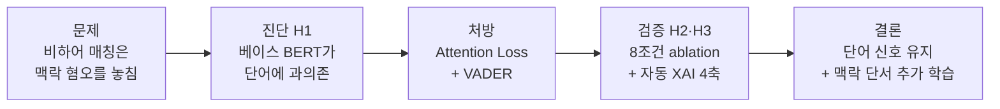

---

## 2. 베이스 모델의 문제 — 왜 고쳐야 하나

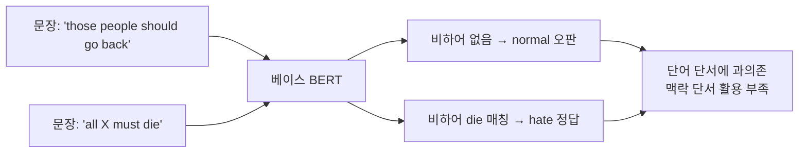

베이스는 비하어가 있으면 잘 맞히고, 비하어 없는 맥락 혐오는 놓친다. **단어 자체가 신호가 아닌 게 아니라, 단어에 *과의존*하는 게 문제.**

---

## 3. 두 처방 — 서로 다른 층위에 개입

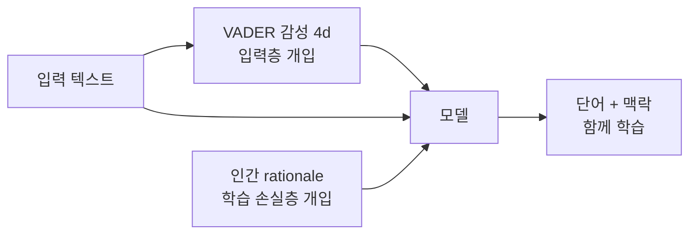

| 처방 | 어느 층위 | 무엇을 가르치나 | 근거 |
|---|---|---|---|
| **VADER 감성 피처** | 입력층 (concat) | "이 문장의 감정 온도" — 맥락 단서 | Cheng 2022 선행연구 기반 사전 가설 |
| **Attention Loss** | 학습 손실층 | "어디를 봐야 하는가" — 인간 근거 토큰에 정렬 | Mathew 2021 rationale을 평가→학습으로 |

두 처방은 직교한다 — VADER는 모델 구조, Attention Loss는 학습 손실. 그래서 ablation으로 따로 떼어 측정할 수 있다.

---

## 4. 모델이 실제로 학습하는 것 (D_B 기준)

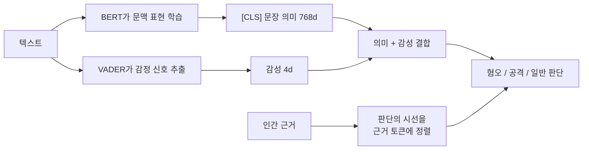

모델은 세 신호를 함께 본다 — **BERT의 문맥 의미**, **VADER의 감정 온도**, 그리고 학습 중 **인간 근거가 가르치는 시선의 방향**. 추론할 땐 텍스트만 있으면 된다 (rationale은 학습 때만).

---

## 5. 8조건 ablation — 두 처방을 따로 떼어 측정

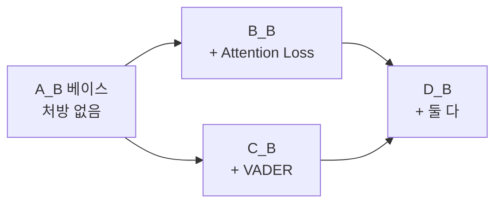

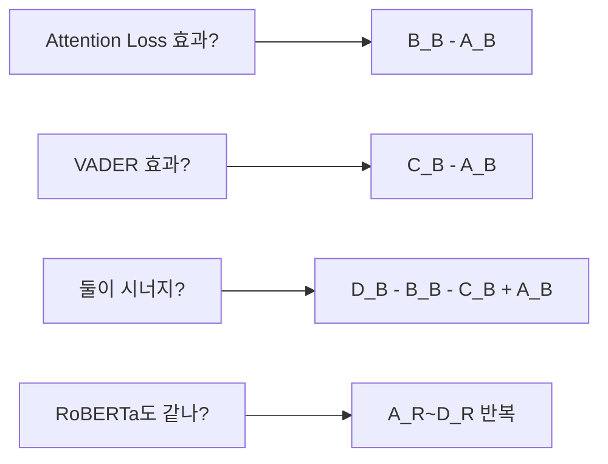

같은 데이터·시드·하이퍼파라미터에서 **한 번에 한 처방만 바꿔** 주효과·상호작용·강건성을 분리한다. 이게 "통제된 ablation".

---

## 6. 무엇이 좋아졌는지 — 두 가지 차원으로 본다

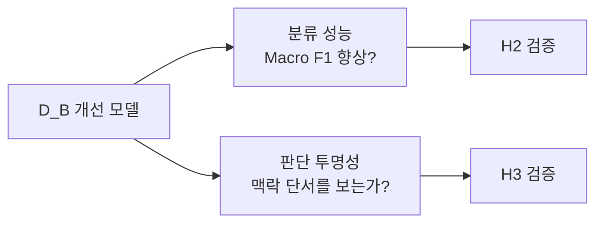

성능만 좋아진 게 아니라 **모델이 판단하는 방식**도 바뀌었는지 본다 — 그게 이 연구의 핵심 주장.

---

## 7. XAI 4축 — 모델이 단어에 기대나, 맥락을 보나

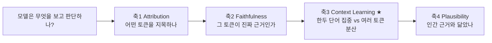

3축 Context Learning이 본 연구의 결정 카드 — **인간이 만든 비하어 목록 같은 카테고리에 기대지 않고**, 모델 내부 토큰 동역학만으로 맥락 학습을 정량화한다.

---

## 8. 단어 의존 → 맥락 의존, 어떻게 드러나나

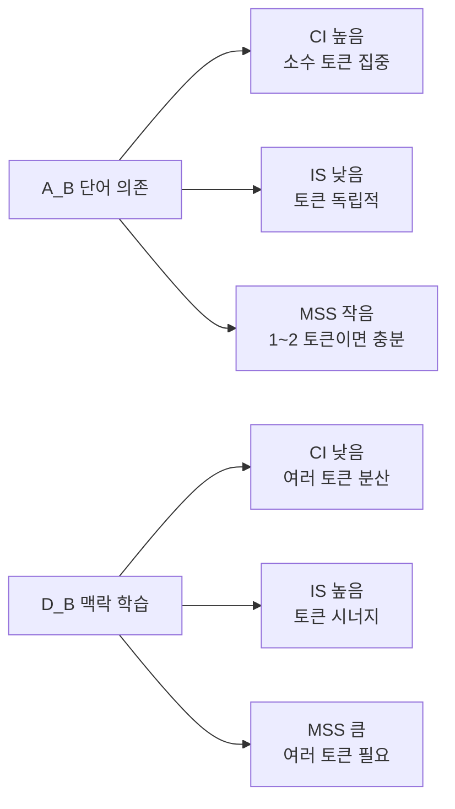

**비유** — A_B는 단거리 선수(혼자 뛴다), D_B는 축구팀(11명 패스로 골). 단어 의존 모델은 토큰 하나하나가 독립이고, 맥락 의존 모델은 토큰들이 함께 작동한다.

---

## 9. 가설 검증 사슬 — H1에서 H3까지

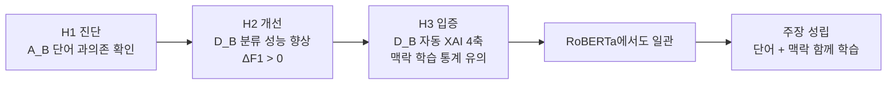

H1 진단에서 출발해 H2(성능)·H3(판단 방식)를 거치고, RoBERTa에서도 같은 패턴이 나오면 주장이 강건해진다. **단일 지표가 아니라 다축 일관성으로 판정** — 한 지표만 좋으면 우연일 수 있으니까.

---

## 10. 전체를 한 흐름으로

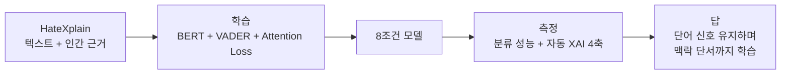

---

## 부록 — 절대 하지 않는 주장

- "혐오는 단어가 아니라 맥락이다" (이분법 과장) — 단어도 신호다. *과의존*이 문제일 뿐.
- "XAI 진단으로 VADER를 골랐다" — VADER는 Cheng 2022 선행연구 기반 사전 가설. XAI는 사후 검증.
- "순환적 프레임워크 / 피드백 루프" — 본 연구는 "가설 → 통제된 ablation → XAI 사후 검증"의 단방향 과학적 검증.

---

문서 끝.
