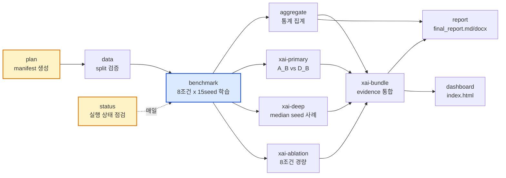
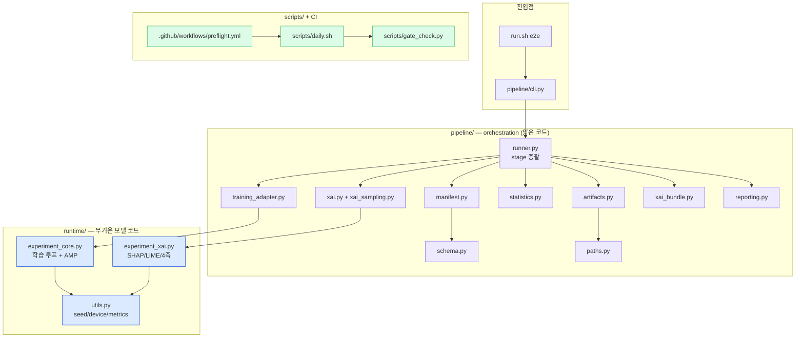
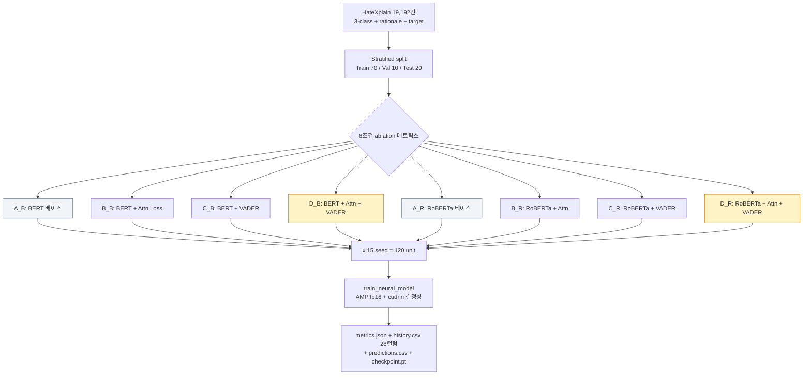
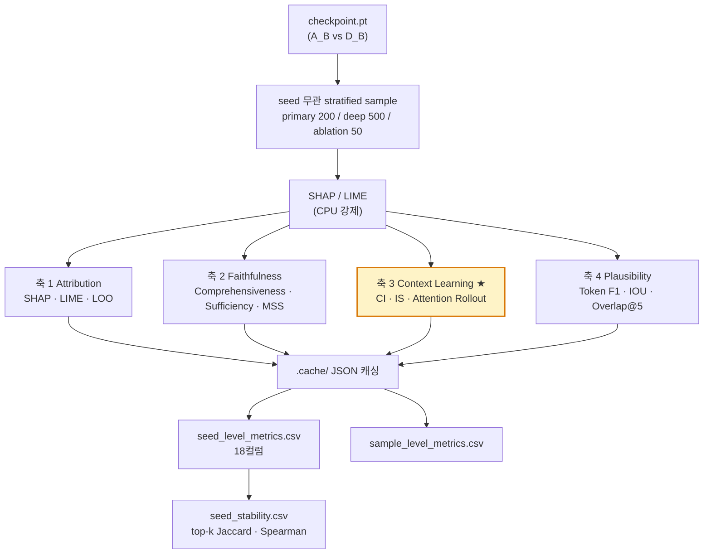
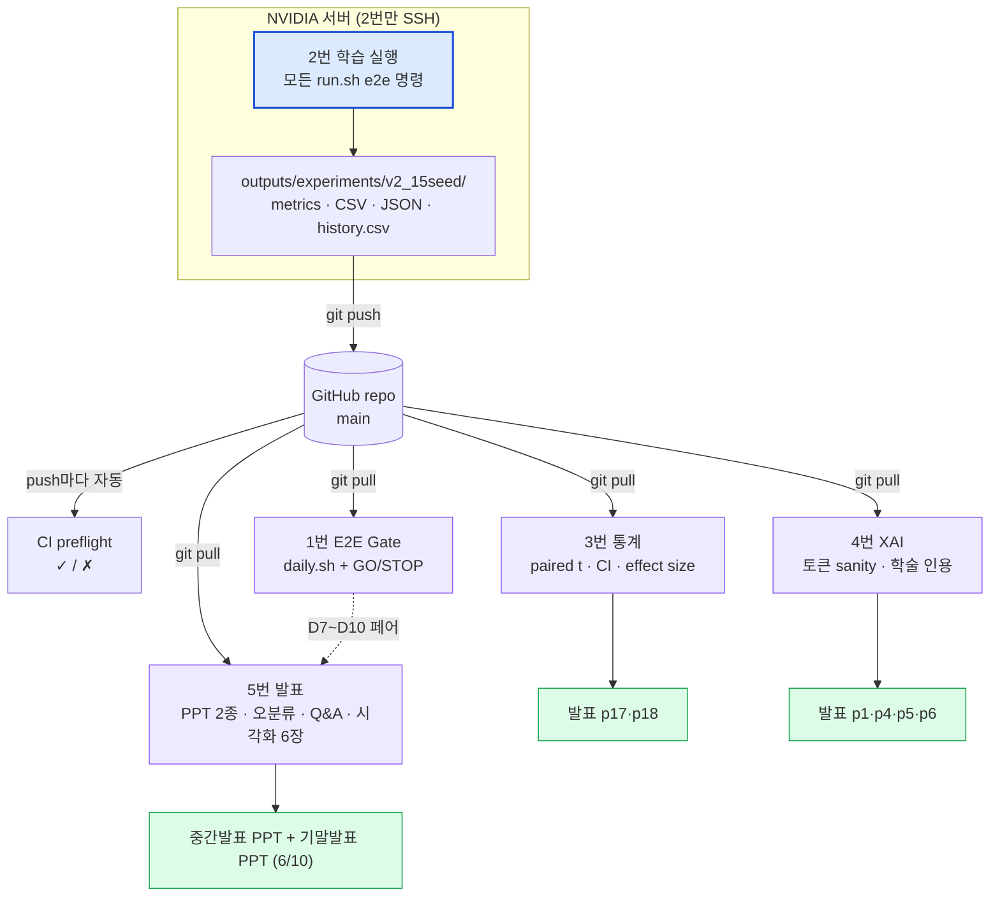
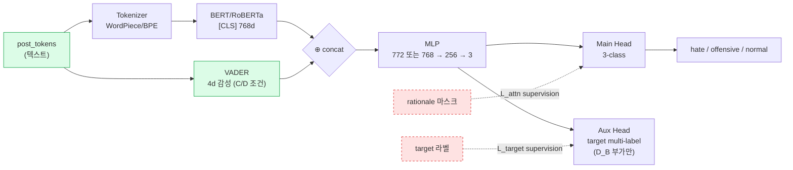
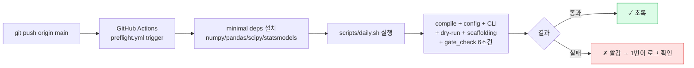
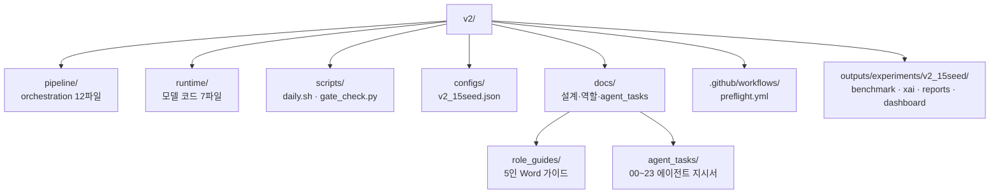

# 24. v2 아키텍처 — Mermaid 다이어그램

> HateSpeachStudy v2_15seed 파이프라인의 전체 구조를 Mermaid로 정리한다.
> GitHub은 ```mermaid 코드블록을 자동 렌더링하므로, 이 문서를 GitHub에서 열면 그림으로 보인다.
> 마지막 업데이트: 2026-05-19

---

## 1. End-to-End 파이프라인 Stage 흐름

`run.sh e2e <stage>` → `pipeline/cli.py` → `pipeline/runner.py`가 각 stage를 호출한다.



---

## 2. 모듈 아키텍처 — 4개 레이어

`pipeline/`은 얇은 orchestration, `runtime/`은 무거운 모델 코드. adapter가 둘을 잇는다.



---

## 3. 8조건 Ablation 매트릭스 + 학습 흐름

`benchmark` stage가 2×2×2 조건 × 15 seed = 120 unit을 학습한다.



손실: `L_total = L_cls + α·L_attn (+ β·L_target)` — α는 B_B에서 그리드 결정 후 D_B/B_R/D_R 동일 적용.

---

## 4. XAI 4축 12지표 구조

`xai-primary/deep/ablation`이 자동 XAI 4축을 계산한다. 인간 라벨 의존을 최소화한 것이 본 연구 결정 카드.



판정: H3 = 축 3 (CI ↓, IS ↑, MSS ↑)이 통계 유의 + RoBERTa 일관 → 맥락 학습 입증.

---

## 5. 5인 역할 + 산출물 + Git 흐름

서버 실행은 2번 단독, 나머지는 git pull로 결과를 받는다.



---

## 6. 데이터 흐름 — 모델 입력 단일 소스 원칙

모델은 텍스트(post_tokens)만 입력으로 받는다. rationale·target은 학습 supervision으로만 사용.



추론 시: 텍스트만 주어져도 동작 (Aux Head 무시, rationale/target 불필요).

---

## 7. CI 자동화 흐름

push마다 GitHub Actions가 preflight를 자동 실행한다.



---

## 부록 — 디렉토리 구조



---

문서 끝.
